# BBH Foundation Visual Review

Date: 2026-06-25  
Audit target: BBH Core OS foundation pass before commit  
Local preview used: `http://127.0.0.1:5200`

## Purpose

Validate that the BBH visual foundation now reads as one operating system before creating the foundation commit.

This review checks the rendered application after the global UI architecture refactor. It does not evaluate business logic, data correctness, backend behavior, or Trading Lab internals.

## Capture Manifest

| Page | Route | Current Screenshot |
| --- | --- | --- |
| Command Center | `/os` | `artifacts/ui-audit/screenshots/command-center-current.png` |
| Studio | `/os/studio` | `artifacts/ui-audit/screenshots/studio-current.png` |
| Studio Project Detail | `/os/studio/projects/karun-central-khon-kaen` | `artifacts/ui-audit/screenshots/studio-project-detail-current.png` |
| Finance | `/os/finance` | `artifacts/ui-audit/screenshots/finance-current.png` |
| Investments | `/os/finance/investments` | `artifacts/ui-audit/screenshots/investments-current.png` |
| Capital | `/os/capital` | `artifacts/ui-audit/screenshots/capital-current.png` |
| AI Workspace | `/os/ai` | `artifacts/ui-audit/screenshots/ai-workspace-current.png` |
| Settings | `/os/settings` | `artifacts/ui-audit/screenshots/settings-current.png` |
| Bridge | `/os/bridge` | `artifacts/ui-audit/screenshots/bridge-current.png` |

## Overall Finding

The foundation pass successfully moves the OS toward a single BBH visual language:

- Light neutral canvas is consistent across all active OS sections.
- Sidebar, shell, active route treatment, and Safety Orange accent are unified.
- Thin rules and reduced shadows make the product feel calmer and more architectural.
- Typography now has stronger editorial hierarchy.
- The app no longer feels like a collection of unrelated products at the shell level.

The remaining inconsistencies are mostly inside page-local content modules:

- Some pages still use KPI-card rows.
- Some modules still feel like SaaS dashboard widgets.
- AI Workspace still has a dark block that breaks the light architectural system.
- Investments has the highest remaining density and the strongest legacy dashboard feel.
- Settings and Bridge still use form-card stacks that need a more refined workspace pattern later.

## Page Reviews

### 1. Command Center

Before screenshot: Not available locally.

Current screenshot:

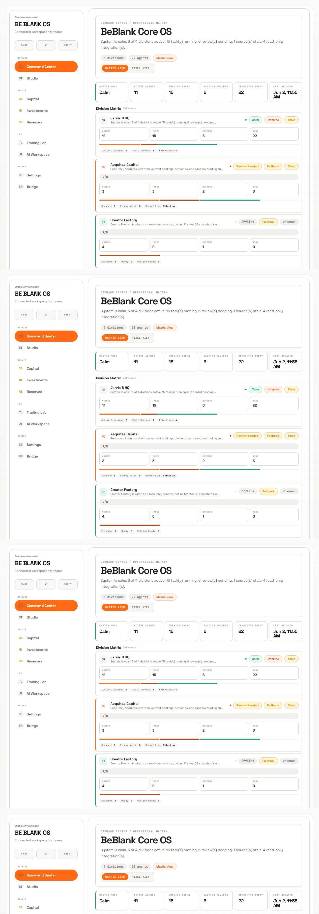

Summary of visual improvements:

- Shell, sidebar, and active state now match the rest of the OS.
- Command Center feels calmer after reduced shadows and softer panels.
- The operating matrix benefits from the lighter canvas and thin-rule treatment.
- Safety Orange is now clearly the active navigation accent.

Remaining inconsistencies:

- Still has a KPI strip near the top, which keeps part of the page in dashboard territory.
- Division Matrix cards are functional but still card-dense.
- Several status chips compete visually.

UI elements still using legacy patterns:

- `command-hero`
- `os-hero-metric`
- Division matrix card rows
- Multiple colored status chips

Readiness score: 7.0 / 10

### 2. Studio

Before screenshot:

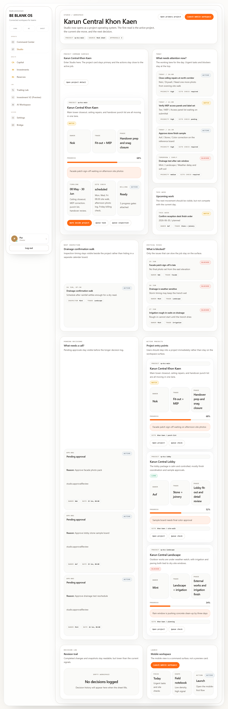

Current screenshot:

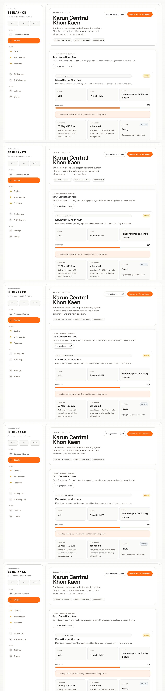

Summary of visual improvements:

- Stronger project-first feel after the shared shell and workspace token pass.
- Studio now sits naturally inside the global OS frame instead of feeling like a separate pilot.
- Orange action treatment is consistent and restrained.
- Reduced panel radius and shadow support the architectural operating sheet direction.

Remaining inconsistencies:

- Project cards still create a nested-card feeling in the main workspace.
- Some metrics still have equal visual weight when project attention should dominate.
- Lower sections may still feel like a dashboard stack once scrolled.

UI elements still using legacy patterns:

- Project card containers
- Small KPI/property blocks inside project cards
- Some `panel` / `panel-float` sections

Readiness score: 8.2 / 10

### 3. Studio Project Detail

Before screenshot:

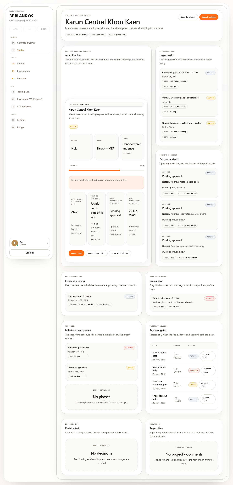

Current screenshot:

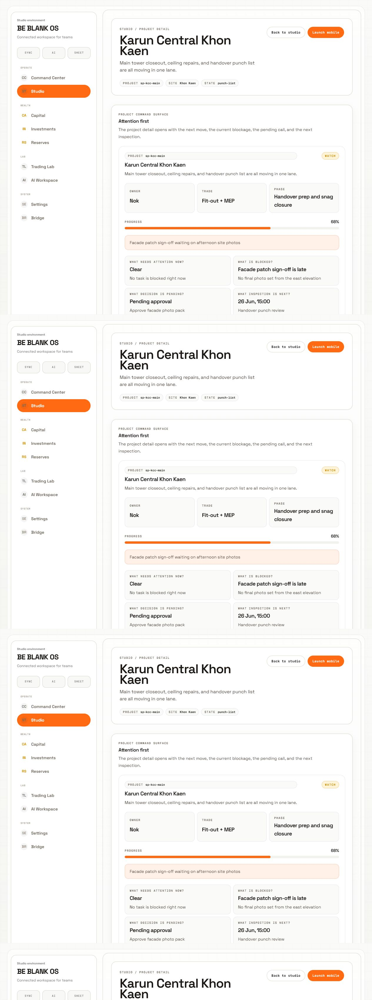

Summary of visual improvements:

- The page now reads closer to a project command surface.
- Attention-first structure is visible above the fold.
- Thin rules and reduced roundness make the detail view more architectural.
- The route is one of the strongest expressions of the intended BBH OS language.

Remaining inconsistencies:

- The attention grid is still composed of cards rather than a fully integrated operating sheet.
- Supporting sections below the fold should eventually become timeline/decision surfaces instead of repeated panels.
- Mobile launch action is visually correct but could later become part of a reusable action rail.

UI elements still using legacy patterns:

- Nested `ProjectCard`
- Four-cell attention grid
- Panel-based supporting sections

Readiness score: 8.4 / 10

### 4. Finance

Before screenshot: Not available locally.

Current screenshot:

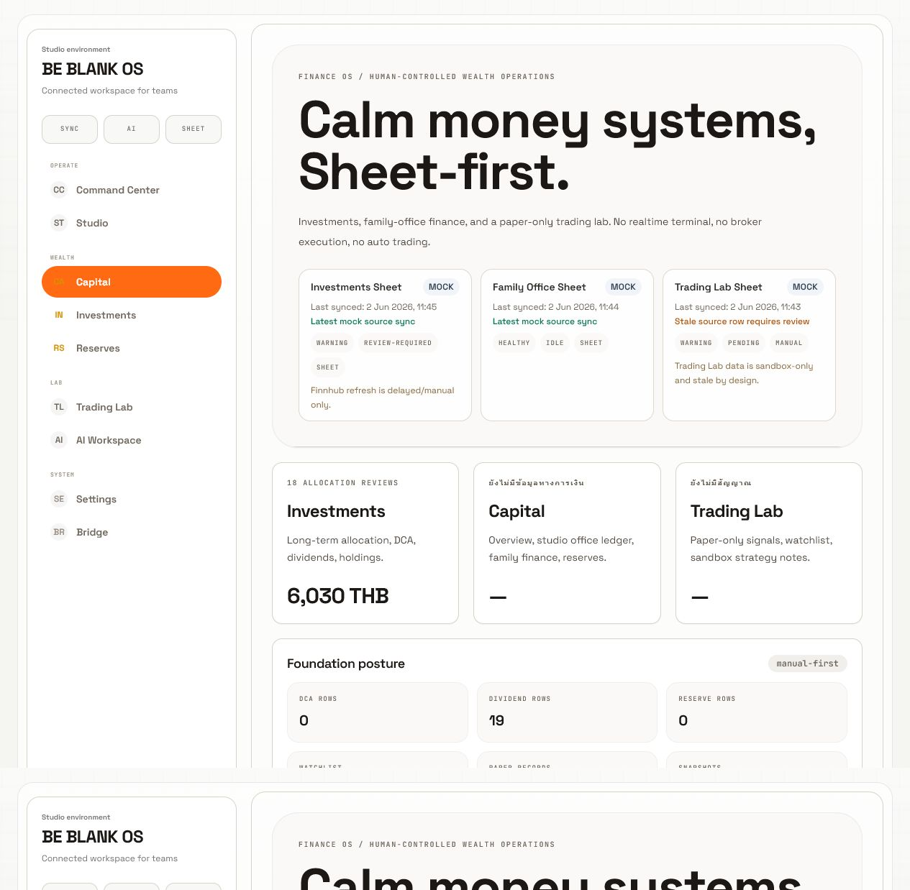

Summary of visual improvements:

- The oversized editorial heading now fits the BBH direction well.
- The page benefits significantly from the lighter shell, thinner borders, and orange active nav.
- Finance reads more like a calm financial operating surface than before.

Remaining inconsistencies:

- Sheet source cards still read as dashboard widgets.
- Allocation cards still have equal visual weight.
- Some Thai/English hierarchy is inconsistent.

UI elements still using legacy patterns:

- `command-hero`
- Sheet source cards
- Allocation review cards
- Foundation posture mini-metrics

Readiness score: 7.6 / 10

### 5. Investments

Before screenshot: Not available for the current active route. Historical investment screenshots exist under `artifacts/pr31/`, but they do not represent this exact pre-foundation route state.

Current screenshot:

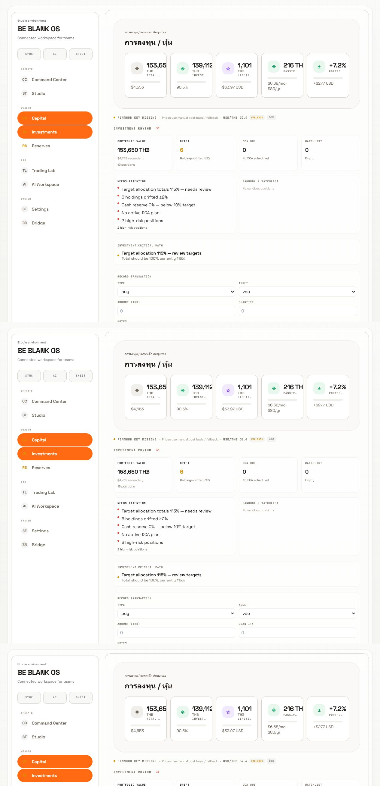

Summary of visual improvements:

- Investments inherits the unified shell and accent system.
- The page is lighter and less shadow-heavy than the previous global style.
- Technical metadata and financial labels sit more comfortably in the neutral palette.

Remaining inconsistencies:

- This is the densest page reviewed.
- The top metric row still feels like a KPI dashboard.
- Colored icon cards introduce more visual noise than the BBH constitution allows.
- Forms and financial panels need a more intentional workspace hierarchy.

UI elements still using legacy patterns:

- KPI card row
- Colored icon badges
- Dense metric panels
- Legacy financial form sections
- Multiple equal-weight action areas

Readiness score: 6.3 / 10

### 6. Capital

Before screenshot: Not available locally.

Current screenshot:

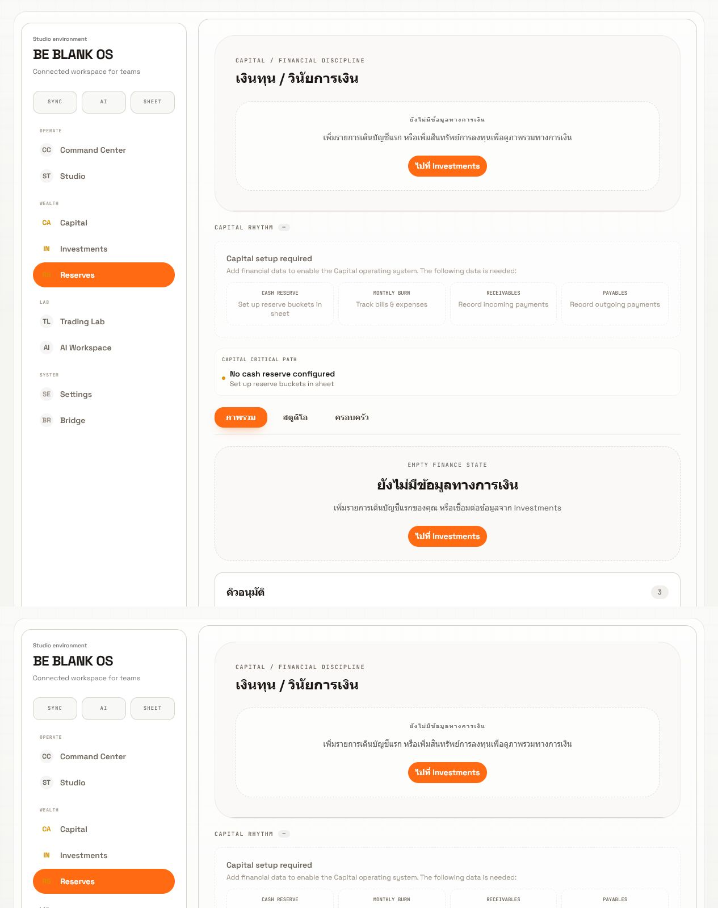

Summary of visual improvements:

- Empty-state surfaces now feel softer and more aligned with the OS.
- The page benefits from the shared shell, orange action language, and thin rules.
- Capital is quieter than Investments and closer to a workspace surface.

Remaining inconsistencies:

- Empty states and setup panels still feel container-heavy.
- Tab treatment is still closer to app dashboard tabs than architectural sections.
- Some financial workflow modules remain visually generic.

UI elements still using legacy patterns:

- `os-card-primary`
- Empty-state cards
- Tab pills
- Financial setup requirement panels

Readiness score: 7.1 / 10

### 7. AI Workspace

Before screenshot: Not available locally.

Current screenshot:

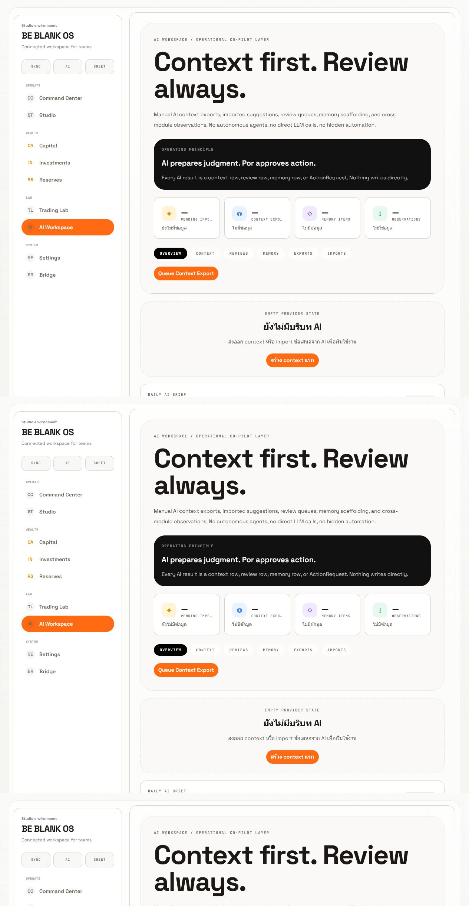

Summary of visual improvements:

- The page now inherits a much stronger global shell and typography system.
- The large editorial heading fits the BBH direction.
- Manual/review-first workflow is legible.

Remaining inconsistencies:

- The dark operating principle block breaks the light architectural system.
- KPI-style cards still sit directly under the hero.
- Black active tab treatment conflicts with the unified Safety Orange active language.

UI elements still using legacy patterns:

- Dark principle panel
- KPI cards
- Black active tab
- Card-based empty provider state

Readiness score: 6.8 / 10

### 8. Settings

Before screenshot: Not available locally.

Current screenshot:

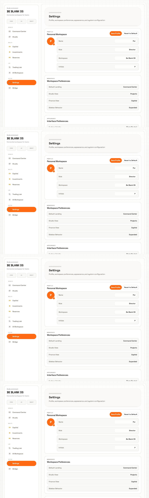

Summary of visual improvements:

- Settings now uses labels that match the foundation direction: thin rules, workspace, Space Grotesk, Geist Mono.
- The shared shell makes Settings feel part of the same OS.
- Reduced radius and shadow help the form panels feel calmer.

Remaining inconsistencies:

- Header eyebrow appears corrupted as question marks and should be cleaned up.
- Form rows still feel like stacked admin settings cards.
- The profile section could use a more deliberate property-panel pattern later.

UI elements still using legacy patterns:

- `os-card-primary`
- Config rows
- Admin-style form fields
- Connector card stacks lower on the page

Readiness score: 7.4 / 10

### 9. Bridge

Before screenshot: Not available locally.

Current screenshot:

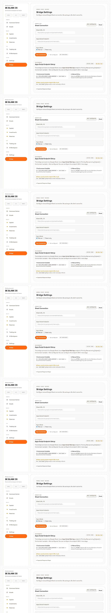

Summary of visual improvements:

- Bridge inherits the unified shell and now feels less detached from the rest of the OS.
- Connection fields and endpoint setup benefit from lighter surfaces and thinner rules.
- The page is readable and production-safe for the foundation commit.

Remaining inconsistencies:

- Still reads partly like a technical admin form.
- Endpoint setup is a card stack rather than an operating procedure surface.
- Needs a clearer source-state / approval-state pattern later.

UI elements still using legacy patterns:

- Connection form cards
- Endpoint setup card
- Test connection action cluster
- Admin-style field layout

Readiness score: 7.3 / 10

## Readiness Summary

| Page | Score | Foundation Commit Readiness |
| --- | ---: | --- |
| Command Center | 7.0 | Ready with known matrix/card density debt |
| Studio | 8.2 | Ready |
| Studio Project Detail | 8.4 | Ready |
| Finance | 7.6 | Ready |
| Investments | 6.3 | Acceptable, but highest priority for next UI pass |
| Capital | 7.1 | Ready with setup-state debt |
| AI Workspace | 6.8 | Acceptable, dark panel should be addressed next |
| Settings | 7.4 | Ready, but eyebrow encoding needs cleanup |
| Bridge | 7.3 | Ready with admin-form debt |

Average readiness: 7.34 / 10

## Foundation Commit Recommendation

Proceed with the foundation commit after review.

The global UI architecture is now consistent enough to establish the BBH foundation:

- The shell is unified.
- The accent system is unified.
- The typography direction is unified.
- The panel language is calmer and less dashboard-like.
- The remaining issues are localized page-pattern debts, not blockers for the foundation layer.

## Next UI Iteration Priorities

1. Replace remaining KPI rows with operating signals.
2. Convert Investments into a financial workspace surface.
3. Replace AI Workspace dark panel with a light operating principle surface.
4. Create reusable `WorkspacePage`, `ActionRail`, `PropertyPanel`, and `OperatingProcedure` patterns.
5. Clean Settings eyebrow encoding.
6. Reduce nested-card structure inside Studio lower sections.
7. Convert Bridge setup into a source-status and approval-state workspace.

